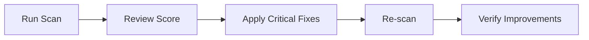

<div align="center">

# 🔥 Fulgul: The Spark

**A comprehensive security scanning and system hardening desktop application**

[](https://github.com/yourusername/fulgul)
[](LICENSE)
[](https://github.com/yourusername/fulgul)
[](https://www.rust-lang.org/)
[](https://www.typescriptlang.org/)

[Features](#-features) • [Installation](#-installation) • [Quick Start](#-quick-start) • [Documentation](#-user-guide) • [Support](#-support)

---


*Screenshot: Fulgul Security Dashboard*

</div>

---

## 📋 Table of Contents

- [About](#-about)
- [Features](#-features)
- [Screenshots](#-screenshots)
- [Installation](#-installation)
- [Quick Start](#-quick-start)
- [User Guide](#-user-guide)
- [Configuration](#-configuration)
- [Security & Privacy](#-security--privacy)
- [Troubleshooting](#-troubleshooting)
- [Contributing](#-contributing)
- [Support](#-support)
- [License](#-license)

---

## 🎯 About

**Fulgul: The Spark** is a powerful, user-friendly desktop application designed to help you secure your system through vulnerability scanning, attack simulations, and automated hardening. Whether you're a security professional, system administrator, or privacy-conscious user, Fulgul provides the tools you need to protect your system.

### Why Fulgul?

- ✅ **Comprehensive Security Scanning** - Detect vulnerabilities before attackers do
- ✅ **Automated Hardening** - 40+ security tasks with one-click fixes
- ✅ **Interactive Learning** - Hands-on attack simulations to learn security
- ✅ **Cross-Platform** - Works on Windows, macOS, and Linux
- ✅ **Privacy-First** - All data stored locally, no cloud dependencies
- ✅ **Modern UI** - Beautiful, intuitive interface built with Material-UI

---

## ✨ Features

### 🔍 Vulnerability Scanning

<table>
<tr>
<td width="50%">

**Local Machine Scan**
- Detects outdated packages and security patches
- Identifies misconfigured services
- Checks file permissions and security settings
- Analyzes open ports and network services
- Scans for known vulnerabilities (CVE database)

</td>
<td width="50%">

**Remote IP Scan**
- Port scanning (1-500 ports)
- Service detection and vulnerability matching
- Real-time progress tracking
- Safe scanning with rate limiting
- Private network protection

</td>
</tr>
</table>

### 🛡️ System Hardening

<div align="center">

| Category | Tasks | Platform Support |
|----------|-------|------------------|
| 🔥 Firewall | 3 tasks | Windows, macOS, Linux |
| 🔐 SSH/Security | 4 tasks | Linux, macOS |
| 🔄 Updates | 3 tasks | All platforms |
| 🔒 Encryption | 3 tasks | All platforms |
| 👤 Access Control | 5 tasks | All platforms |
| 🔑 Password Policy | 2 tasks | All platforms |
| 🛠️ Services | 3 tasks | All platforms |
| 📊 Logging | 2 tasks | All platforms |

</div>

**Key Features:**
- ✅ **40+ Hardening Tasks** - Platform-specific recommendations
- ✅ **One-Click Fixes** - Interactive terminal for command execution
- ✅ **Manual Guides** - Step-by-step instructions when needed
- ✅ **Impact Assessment** - Know what each fix does
- ✅ **Time Estimates** - Plan your hardening session

### 🎮 Attack Simulation Hub

Learn security through hands-on practice with interactive attack scenarios:

- 🎯 **Vulnerable Web Applications** (DVWA-style)
- 🔓 **Weak SSH Credentials**
- 📁 **SMB Guest Shares**
- 🌐 **Vulnerable REST APIs**
- ⚡ **Real-time Command Execution**
- 🏁 **Flag Capture System**
- 📈 **Progress Tracking & Scoring**

### 📊 Security Dashboard

<div align="center">

```
┌─────────────────────────────────────┐
│  Security Score: 85/100             │
│  Grade: Good ✓                      │
│                                     │
│  Vulnerabilities: 12                │
│  Critical: 2  High: 4  Medium: 6    │
│                                     │
│  Last Scan: 2 hours ago             │
│  Hardening Tasks: 8/40 completed    │
└─────────────────────────────────────┘
```

</div>

**Real-time Monitoring:**
- 📊 Security score (0-100) with visual gauge
- 🎯 Security grade (Excellent to Critical)
- 📈 Vulnerability statistics
- 📅 Scan history with timestamps
- ✅ Remediation status tracking

### 🔧 Advanced Features

- **Fix Management** - Track and apply security fixes with status tracking
- **Scan History** - Complete audit trail with export capabilities
- **Interactive Terminal** - Real-time command execution with password support
- **Export Options** - JSON, CSV, PDF export for reports
- **Filter & Search** - Powerful filtering and search capabilities

---

## 📸 Screenshots

<div align="center">

| Dashboard | Vulnerability Scan | System Hardening |
|-----------|-------------------|------------------|
|  |  |  |

| Attack Hub | Scan History | Vulnerabilities |
|------------|--------------|-----------------|
|  |  |  |

</div>

---

## 🚀 Installation

### System Requirements

| Platform | Minimum Version | RAM | Disk Space |
|----------|----------------|-----|------------|
| **Windows** | Windows 10 (1809+) or Windows 11 | 4 GB | 100 MB |
| **macOS** | macOS 10.13 (High Sierra) or later | 4 GB | 100 MB |
| **Linux** | Kernel 3.10+, glibc 2.17+ | 4 GB | 100 MB |

---

### Windows

<details>
<summary><b>Click to expand Windows installation instructions</b></summary>

#### Option 1: NSIS Installer (Recommended)

1. **Download** `fulgul_0.1.0_x64-setup.exe`
2. **Run** the installer
3. **Follow** the installation wizard
4. **Launch** from Start menu or desktop shortcut

#### Option 2: MSI Installer

1. **Download** `fulgul_0.1.0_x64_en-US.msi`
2. **Double-click** to install
3. **Launch** from Start menu

**Default Installation Path:** `C:\Program Files\Fulgul`

</details>

---

### macOS

<details>
<summary><b>Click to expand macOS installation instructions</b></summary>

#### For Intel Macs

1. **Download** `fulgul_0.1.0_x64.dmg`
2. **Open** the DMG file
3. **Drag** "Fulgul" to Applications folder
4. **Eject** the DMG

#### For Apple Silicon (M1/M2/M3)

1. **Download** `fulgul_0.1.0_arm64.dmg`
2. **Open** the DMG file
3. **Drag** "Fulgul" to Applications folder
4. **Eject** the DMG

#### First Launch

1. Open **Applications** folder
2. **Right-click** "Fulgul" → **Open** (first time only)
3. Click **"Open"** when prompted about unidentified developer

**Alternative:** Remove quarantine attribute:
```bash
xattr -cr /Applications/Fulgul.app
```

</details>

---

### Linux

<details>
<summary><b>Click to expand Linux installation instructions</b></summary>

#### AppImage (Recommended - Portable)

```bash
# Download
wget https://releases.example.com/fulgul_0.1.0_amd64.AppImage

# Make executable
chmod +x fulgul_0.1.0_amd64.AppImage

# Run
./fulgul_0.1.0_amd64.AppImage
```

#### Debian/Ubuntu (.deb)

```bash
# Download
wget https://releases.example.com/fulgul_0.1.0_amd64.deb

# Install
sudo dpkg -i fulgul_0.1.0_amd64.deb
sudo apt-get install -f  # Fix dependencies if needed

# Launch
fulgul
```

#### Red Hat/Fedora (.rpm)

```bash
# Download
wget https://releases.example.com/fulgul_0.1.0.x86_64.rpm

# Install
sudo rpm -i fulgul_0.1.0.x86_64.rpm
# Or with dnf
sudo dnf install fulgul_0.1.0.x86_64.rpm

# Launch
fulgul
```

#### Arch Linux (AUR)

```bash
yay -S fulgul
# or
paru -S fulgul
```

</details>

---

## ⚡ Quick Start

### 1️⃣ First Launch

```bash
# Launch the application
fulgul  # Linux
# Or use the desktop shortcut/Start menu
```

### 2️⃣ Run Your First Scan

1. Click **"Scan Local Machine"** from the dashboard
2. Wait for scan to complete (~1-3 minutes)
3. Review your security score and vulnerabilities

### 3️⃣ Apply Hardening

1. Navigate to **"Harden Systems"** from the sidebar
2. Filter by **"Critical"** priority
3. Click **"Apply Fix"** on recommended tasks
4. Enter password if prompted

### 4️⃣ Explore Features

- 🎮 Try the **Attack Hub** for hands-on learning
- 📊 Review **Scan History** to track improvements
- 🔍 Use **Remote Scan** to check network devices

---

## 📖 User Guide

### 🔍 Scanning Your System

#### Local Machine Scan

<details>
<summary><b>Step-by-step guide</b></summary>

1. Navigate to **Scan Local** from the sidebar
2. Click **"Start Scan"** button
3. Monitor real-time progress:
   - Current scan step
   - Discovered vulnerabilities
   - Security score updates
4. Review results:
   - Security score and grade
   - List of vulnerabilities
   - Open ports and services
   - Recommended fixes

</details>

#### Remote IP Scan

<details>
<summary><b>Step-by-step guide</b></summary>

1. Navigate to **Scan Remote** from the sidebar
2. Enter the target IP address (e.g., `192.168.1.10`)
3. Click **"Start Scan"**
4. Watch real-time progress:
   - Port scanning progress (1-500 ports)
   - Discovered open ports
   - Service detection
5. Review results:
   - Open ports list
   - Detected services
   - Potential vulnerabilities

> ⚠️ **Important**: Only scan IPs you own or have explicit permission to scan.

</details>

### 🛡️ System Hardening

<details>
<summary><b>Complete hardening guide</b></summary>

1. Navigate to **Harden Systems** from the sidebar
2. **Browse** available hardening tasks:
   - Filter by priority (Critical, High, Medium, Low)
   - Filter by category (Firewall, SSH, Updates, etc.)
   - Search for specific tasks
3. **Review** task details:
   - Description and impact
   - Estimated time
   - Reboot requirements
   - Suggestions and manual steps
4. **Apply** fixes:
   - Click **"Apply Fix"** for auto-fixable tasks
   - Enter password if prompted (for sudo/admin commands)
   - Follow manual steps for tasks without auto-fix

</details>

### 🎮 Attack Simulation Hub

<details>
<summary><b>How to use the Attack Hub</b></summary>

1. Navigate to **Attack Hub** from the sidebar
2. **Select** a scenario:
   - Choose difficulty (Easy, Medium, Hard)
   - Read scenario description
   - View available flags
3. **Start** the attack:
   - Click **"Start Attack"**
   - Use the interactive terminal
   - Execute commands to progress
   - Capture flags to complete
4. **Track** progress:
   - View real-time logs
   - Monitor step completion
   - Check your score

</details>

### 📊 Managing Vulnerabilities

<details>
<summary><b>Vulnerability management guide</b></summary>

1. Navigate to **Vulnerabilities** from the sidebar
2. **View** all detected vulnerabilities:
   - Filter by severity
   - Filter by status
   - Search by title or description
3. **Apply** fixes:
   - Click on a vulnerability card
   - Review suggested fix
   - Click **"Apply Auto-Fix"** if available
   - Or follow manual steps
4. **Track** remediation:
   - Status updates (pending → in-progress → fixed)
   - View fix history
   - Export results

</details>

---

## 🎯 Common Use Cases

### 🔐 First-Time Security Audit



1. Run a **Local Machine Scan**
2. Review the security score and vulnerabilities
3. Go to **Harden Systems** and apply critical/high priority fixes
4. Re-scan to verify improvements

### 🔄 Regular Security Maintenance

- Schedule **weekly scans**
- Review **new vulnerabilities**
- Apply **recommended hardening tasks**
- Monitor **security score trends**

### 🎓 Learning Security

- Use the **Attack Hub** to practice
- Try different scenarios
- Learn common vulnerabilities
- Practice remediation techniques

### 🌐 Network Security Assessment

- Use **Remote IP Scan** to check network devices
- Identify exposed services
- Review open ports
- Apply network hardening recommendations

---

## ⚙️ Configuration

### Auto-Response Settings

Configure automated responses to security threats:

| Setting | Description | Default |
|---------|-------------|---------|
| **Auto-Patch** | Automatically apply security patches | Disabled |
| **Auto-Quarantine** | Isolate suspicious processes | Disabled |
| **Auto-Notify** | Get alerts for security events | Enabled |
| **Patch Delay** | Delay before auto-patching (seconds) | 60 |
| **Quarantine Threshold** | Severity level for auto-quarantine | Critical |

**How to configure:**
1. Navigate to **Auto-Response** from the sidebar
2. Toggle features on/off
3. Set thresholds and delays
4. Save settings

### Preferences

- **Theme**: Dark mode (default) with cyber-security styling
- **Notifications**: Desktop notifications for security events
- **Auto-updates**: Check for application updates

---

## 🔒 Security & Privacy

### Data Storage

<div align="center">

| Platform | Storage Location |
|----------|------------------|
| **Linux** | `~/.fulgul/scan_history.json` |
| **macOS** | `~/.fulgul/scan_history.json` |
| **Windows** | `%APPDATA%\fulgul\scan_history.json` |

</div>

- ✅ All scan data is stored **locally** on your machine
- ✅ **No data** is sent to external servers
- ✅ **No telemetry** or tracking
- ✅ **Open source** backend (Rust) for transparency

### Permissions

Some features require elevated permissions:

| Feature | Permission Required |
|---------|-------------------|
| System Hardening | Administrator/sudo access |
| Port Scanning | Network access |
| Service Management | Root/admin privileges |
| File System Access | Read permissions for scanning |

### Best Practices

1. ✅ **Run scans regularly** (weekly recommended)
2. ✅ **Review findings** before applying fixes
3. ✅ **Backup your system** before major hardening changes
4. ✅ **Test in a safe environment** first
5. ✅ **Keep the app updated** for latest vulnerability databases

---

## 🐛 Troubleshooting

### Application Won't Start

<details>
<summary><b>Windows</b></summary>

- Check **Windows Event Viewer** for errors
- Install **Visual C++ Redistributable**: [Download](https://aka.ms/vs/17/release/vc_redist.x64.exe)
- Run as **administrator** if needed
- Check **antivirus** isn't blocking the app

</details>

<details>
<summary><b>macOS</b></summary>

- Right-click app → **Open** (first time)
- Check **System Preferences → Security & Privacy**
- Remove quarantine: `xattr -cr /Applications/Fulgul.app`
- Check **Gatekeeper** settings

</details>

<details>
<summary><b>Linux</b></summary>

- Check dependencies: `ldd fulgul` (for missing libraries)
- Install missing dependencies based on error messages
- Check file permissions: `chmod +x fulgul`
- Check **AppArmor/SELinux** policies

</details>

### Scan Fails or Hangs

1. Check system resources (CPU, RAM)
2. Ensure you have network connectivity (for remote scans)
3. Verify you have necessary permissions
4. Try running as administrator/sudo
5. Check application logs

### Hardening Tasks Fail

1. Verify you have required permissions
2. Check if the task is applicable to your OS version
3. Review error messages in the terminal
4. Try manual steps instead of auto-fix
5. Ensure system is not in a restricted state

### Terminal Commands Not Working

1. Verify the command syntax is correct for your OS
2. Check if required tools are installed
3. Ensure you're using the correct shell (bash on Linux/macOS, PowerShell on Windows)
4. Review command output for specific errors

---

## 🤝 Contributing

We welcome contributions! Here's how you can help:

- 🐛 **Report bugs** via issue tracker
- 💡 **Suggest features** through discussions
- 📝 **Improve documentation**
- 🔧 **Submit pull requests**

See [CONTRIBUTING.md](CONTRIBUTING.md) for guidelines.

---

## 📞 Support

### Getting Help

- 📚 **Documentation**: Check this README and deployment guides
- 🐛 **Issues**: [Report bugs](https://github.com/yourusername/fulgul/issues)
- 💬 **Discussions**: [Join the community](https://github.com/yourusername/fulgul/discussions)
- 📧 **Email**: support@fulgul.example.com

### Reporting Issues

When reporting issues, please include:

- Operating system and version
- Fulgul version
- Steps to reproduce
- Error messages or screenshots
- System logs (if applicable)

---

## 🔄 Updates

### Checking for Updates

- The application will **notify you** when updates are available
- Or manually check: **Help → Check for Updates**

### Updating

| Platform | Update Method |
|----------|--------------|
| **Windows** | Download and run the new installer |
| **macOS** | Download new DMG and replace the app |
| **Linux** | Download new package and install (upgrades existing) |

---

## 📝 License

This software is **proprietary**. All rights reserved.

---

## 🙏 Acknowledgments

Built with amazing open-source technologies:

<div align="center">

| Technology | Purpose |
|------------|---------|
| [Tauri](https://tauri.app/) | Desktop app framework |
| [Next.js](https://nextjs.org/) | React framework |
| [Material-UI](https://mui.com/) | UI components |
| [Rust](https://www.rust-lang.org/) | Systems programming |

</div>

---

## 📚 Additional Resources

- 🔒 **Security Best Practices**: See hardening task descriptions
- 🗄️ **Vulnerability Database**: CVE information in scan results
- 🎮 **Attack Scenarios**: Educational content in Attack Hub
- 📖 **Deployment Guides**: See `DEPLOY_WINDOWS.md`, `DEPLOY_MACOS.md`

---

<div align="center">

### 🔥 Stay Secure! 🔒

**Fulgul: The Spark** - Your comprehensive security companion

[⬆ Back to Top](#-fulgul-the-spark)

Made with ❤️ by the Fulgul Team

</div>
